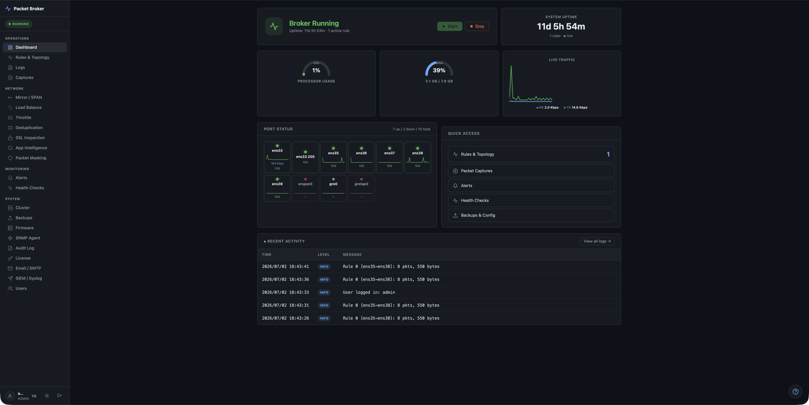
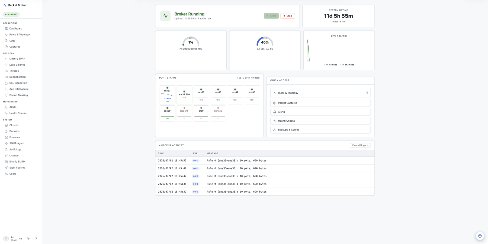
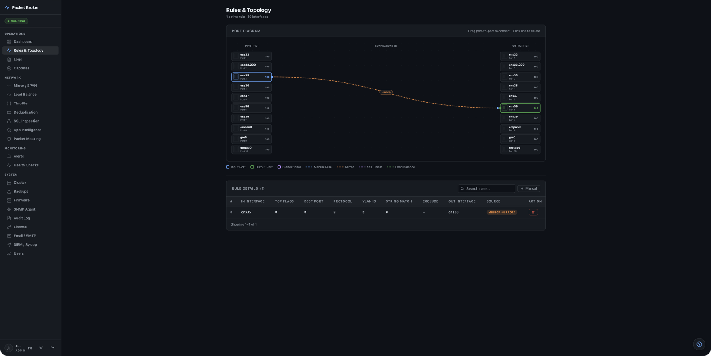
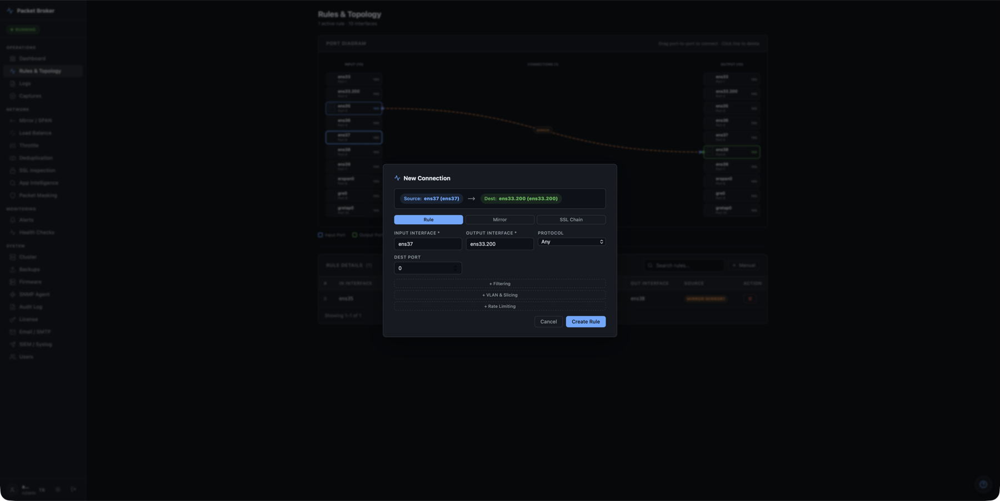

<p align="center">
  
</p>

<h1 align="center">Open Packet Broker</h1>

<p align="center">
  <b>Hardware-grade network packet broker with a web UI — fully open source.</b><br/>
  Capture, filter, manipulate, mirror, load-balance and forward packets between interfaces,
  driven by rules. A Go control plane on top of a C data plane (libpcap · AF_XDP · DPDK).
</p>

<p align="center">
  <a href="LICENSE"></a>
  
  
  
</p>

---

Open Packet Broker started as a single-file C tool and has grown into a full software packet
broker: a **C data plane** that captures, matches and forwards at speed, and a **Go web UI** that
manages the rules, topology and monitoring. It does what a commercial hardware NPB does —
filtering, VLAN manipulation, SPAN mirroring, load balancing, SSL inspection and deduplication —
on plain Linux or embedded ARM, with no appliance and no vendor lock-in.

## Screenshots

<p align="center">
  
  
</p>
<p align="center"><sub><b>Dashboard</b> — broker status, CPU/memory, live traffic, per-port stats and recent activity. Dark & light themes.</sub></p>

<p align="center">
  
  
</p>
<p align="center"><sub><b>Rules &amp; Topology</b> — a drag-to-connect 24-port diagram and a rule builder for mirror / SSL-chain / load-balance connections, with live filtering, VLAN and rate-limit options.</sub></p>

## Architecture

```
┌─────────────────────────────────────────────────┐
│                   Web UI (Go)                    │
│  :8005  │  Auth, Rules, Topology, Monitoring     │
├─────────────────────────────────────────────────┤
│         C Data Plane (libpcap / AF_XDP / DPDK)   │
│   Packet capture → Rule matching → Forwarding    │
├─────────────────────────────────────────────────┤
│               Linux / Embedded ARM               │
│           Network interfaces (eth0..ethN)        │
└─────────────────────────────────────────────────┘
```

The Go control plane is pure-Go (CGO-free, embedded SQLite); the C data plane is a standalone
binary the UI supervises — pick `libpcap` (portable), `AF_XDP` (zero-copy fast path), or `DPDK`.

## Features

| Category | Features |
|---|---|
| **Core** | Rule-based forwarding, 24-port topology (drag-to-connect SVG), priority ordering, enable/disable, dynamic rule reload |
| **Filtering** | Protocol, port, IP (CIDR), MAC, TCP flags, VLAN, string match, full BPF, exclude rules |
| **Manipulation** | VLAN add/remove/change, packet truncation / slicing |
| **Mirroring** | 1:N SPAN — copy traffic to multiple tool ports |
| **Load Balancing** | Round-robin / 5-tuple hash port groups |
| **SSL Inspection** | Routing chains: encrypted → decrypt tool → reinject |
| **Deduplication** | CRC32 hash-based duplicate removal |
| **Rate Limiting** | Per-rule token bucket (Mbps + PPS) |
| **PCAP Capture** | Start/stop capture, download `.pcap` files |
| **Monitoring** | Port stats, link status, threshold alerts, webhook notifications |
| **Health Checks** | Auto-disable rules when tool ports go down |
| **SIEM** | Syslog forwarding (RFC 5424, UDP/TCP, CEF) |
| **Security** | Bcrypt auth, CSRF, rate limiting, RBAC, 2FA/TOTP, audit log |
| **Management** | Config backup/restore, firmware update, cluster mode, i18n |

## Quick Start

```bash
git clone https://github.com/kdrypr/Open-Packet-Broker
cd Open-Packet-Broker

# 1 — control plane (pure Go, no CGO)
go build ./cmd/packet-broker

# 2 — C data plane (Linux; needs libpcap-dev)
gcc -O2 -o packet_broker c_src/packet_broker_libpcap.c -lpcap -lpthread

#     optional AF_XDP zero-copy path (needs clang + libbpf-dev + libxdp-dev):
# clang -O2 -o packet_broker_afxdp c_src/packet_broker_afxdp.c c_src/bpf_helpers.c -lpcap -lbpf -lxdp

# 3 — run, then open the UI
sudo ./packet-broker
# → http://localhost:8005   (default login: admin / admin — change it)
```

### ARM cross-compile

```bash
GOOS=linux GOARCH=arm64 go build ./cmd/packet-broker
aarch64-linux-gnu-gcc -O2 -o packet_broker c_src/packet_broker_libpcap.c -lpcap -lpthread
```

### Deploy (systemd)

```bash
sudo cp deploy/packet-broker.service /etc/systemd/system/
sudo systemctl daemon-reload
sudo systemctl enable --now packet-broker
```

## Project Layout

```
cmd/packet-broker/   # entry point (web server + handlers)
cmd/keygen/          # optional license key tooling
internal/            # broker, capture, rules, mirror, portgroup, ssldecrypt,
                     # dedup, throttle, syslog, cluster, healthcheck, netstats,
                     # sysinfo, alerts, backup, auth, totp, auditlog, firmware…
templates/           # dark-theme server-rendered HTML UI
c_src/               # C data plane — libpcap + AF_XDP variants, fuzzers, load-test
deploy/              # systemd unit
docs/                # project website (GitHub Pages)
```

## Website

A landing page lives in [`docs/`](docs/) and can be published with **GitHub Pages**
(Settings → Pages → Source: `main` / `/docs`).

## Contributing

Issues and PRs welcome — this is MIT-licensed and meant to be hacked on. The C data plane and the
Go control plane are cleanly separated, so you can extend either side independently.

## License

[MIT](LICENSE) © kdrypr. Free to use, modify and self-host.
